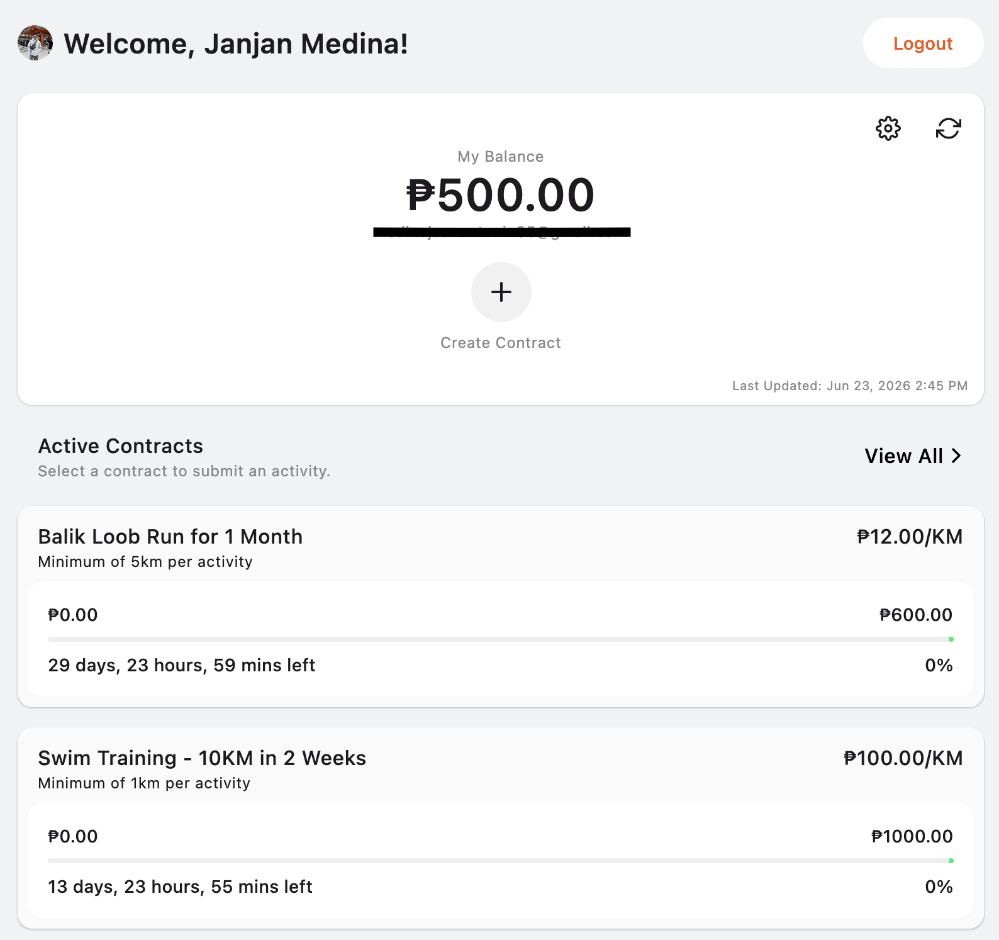

# Runsom

**Lock your money. Earn it back through movement.**

Runsom is a proof-of-concept desktop application that helps motivate physical activity by turning
your own money into a challenge.

The concept is simple:

1. Create a contract.
2. Lock funds in an escrow account.
3. Complete real-world activities tracked through Strava.
4. Unlock your money as you make progress.

Runsom is designed around the idea that people are more motivated when they have
something meaningful to work toward. By having a tangible reward for physical activities, people
would be more inspired to reach their goal.

> ⚠️ Project Status: Active Development
>
> Runsom is currently a proof of concept and should not be considered production-ready. Features and
> contract rules may change as the project evolves.

## How It Works

Runsom uses two Coins.PH accounts:

### Owner Account

The account that creates contracts and ultimately receives unlocked funds.

### Escrow Account

The account that temporarily holds contract funds and releases them as activities are completed.

Example:

* Create a contract worth ₱500
* Set reward rate to ₱10/km
* Creating a Contract automatically deposits ₱500 into the Escrow Account
* Complete activities through Strava
* Receive ₱10 for every valid kilometer completed
* Continue until the contract is fulfilled

## Tech Stack

* Compose Multiplatform (Desktop)
* Kotlin Multiplatform (KMP)
* Room Database
* Koin
* Ktor
* Coil
* Multiplatform Settings
* Strava API
* Coins.PH API

## Contract Rules

Runsom applies several rules when validating activities and calculating rewards.

### 1. Rewards are based on completed kilometers

Rewards are calculated using:

```text
Completed Kilometers × Reward Per Kilometer
```

Submitting a 3.9KM Run would only get you 3KM worth of Rewards. (I apologize in advance to anyone
being taxed by Strava.)

### 2. Only activities completed after contract creation are valid

Activities recorded before a contract was created cannot be submitted.

### 3. Minimum Distance Requirements

Contracts may define a minimum distance required per activity.

Example:

```text
Minimum Distance: 3 km
```

A 2 km run would not qualify.

The default minimum distance is **1 km**.

### 4. Maximum Activity Contracts

Contracts may limit the total number of activities that can be submitted.

When a contract has a maximum activity limit, the final activity must satisfy any remaining distance
required to complete the contract.

### 5. Claimable Kilometers

Runsom automatically calculates how many kilometers remain claimable.

Example:

```text
Contract Goal: 20 km
Completed: 17 km
Remaining: 3 km

Submitted Activity: 5 km
```

Only **3 km** will be rewarded because that is all that remains to fulfill the contract.

The application displays claimable kilometers before submission.

## Setup Requirements

### Strava

To build and run your own version of Runsom, you will need:

* Strava Client ID
* Strava Client Secret

Runsom uses OAuth authentication to access activities from your Strava account.

> Note: Access to the Strava API Settings requires an eligible Strava account
> and paid subscription.

### Coins.PH

### Owner Account

Required:

* API Key
* Secret Key

These credentials are stored locally on your device and are never transmitted to a Runsom server.

### Escrow Account

You may configure the escrow account in one of two ways:

#### Option A: Email Only

Provide the email address of the escrow account.

Submitting an activity will generate a payment request that must be approved manually by the escrow
account holder.

#### Option B: API Key + Secret Key

Provide:

* API Key
* Secret Key

This enables automatic payouts after successful activity submission.

> Recommended: Use an escrow account owned by a trusted friend, partner, family member, or a
> separate personal account dedicated to holding contract funds.

## Current Features

### Strava Integration

* OAuth Authentication
* Activity Synchronization
* Activity Validation

### Coins.PH Integration

* Owner Account Configuration
* Escrow Account Configuration
* Payment Requests
* Automatic Payouts (when escrow credentials are provided)

### Contract Management

* Create Contracts
* Configure Contract Rules
* Submit Activities
* Track Progress
* Calculate Rewards

### Local-First Storage

All application data is stored locally on the user's machine.

This includes:

* Contracts
* Activities
* Settings
* Coins.PH Configuration

## Use Cases

### Self-Motivation

Create contracts using your own money and unlock funds through completed activities.

Example:

```text
₱1,000 Contract
₱20 per kilometer
50 km Goal
```

### Partner Reward System

Create a contract for your spouse, partner, child, friend, or training partner.

Reward them for completing activities while maintaining accountability through an escrow account.

### Race Preparation

Set aside your race registration money and lock it in a contract. Complete your training runs to gradually unlock the funds, helping you stay committed to your race goals before registration day.

### Fitness Accountability Groups

Friends can act as each other's escrow partners.

This creates an additional layer of commitment and social accountability.

### Habit Building

Use Runsom to encourage:

* Running
* Walking
* Cycling
* Swimming
* Other Strava-supported activities

### Goal-Based Challenges

Create contracts around specific goals:

* Run 100 km this month
* Complete 20 workouts
* Finish a cycling challenge

## Platforms

### Currently Supported

* Desktop (Windows, macOS, Linux)

Desktop is currently the primary development target.

### Planned

* Android
* iOS

The application architecture is built using Kotlin Multiplatform, making mobile support possible in
the future.

However, desktop remains the current focus, particularly because Coins.PH API integrations often
rely on IP-whitelisting requirements that are easier to manage in a desktop environment.

## Security

Runsom follows a local-first design philosophy.

* No Runsom cloud backend
* No Runsom account system
* Credentials stored locally
* User controls all contract data

Users are responsible for securing:

* Strava credentials
* Coins.PH credentials
* Escrow account relationships

Always use trusted escrow partners and review contract settings carefully before transferring funds.

## Disclaimer

Runsom is an experimental project intended for personal motivation and accountability.

Users are solely responsible for:

* Funds transferred between accounts
* Contract configurations
* Escrow relationships
* API credentials

Use at your own risk.

## Screenshots

